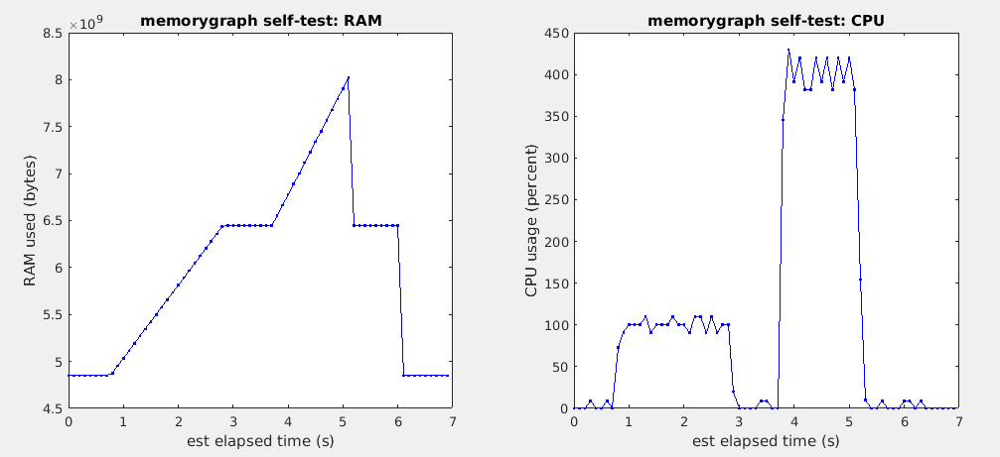

# memorygraph
MATLAB/octave unix tool to record true MATLAB/octave memory and CPU usage vs time

<b>Alex Barnett</b>  1/30/18-3/14/18; version of 10/15/18.  With improvements by Joakim Anden, Jeremy Magland.



One point of this tool is to be able to extract reliable
true peak RAM usage by
a MATLAB/ocatve code, without the need to continuously human-read (h)top.
The example graphs above show RAM and CPU usage vs time, when executing the
MATLAB commands
```
pause(1)
a = randn(1,2e8);              % fills 1.6GB RAM. randn is single-threaded
pause(1)
b = exp(a);                    % fills another 1.6GB. Uses 8 threads
clear a                        % frees up the first 1.6GB
pause(1)
clear b                        % frees up the remaining 1.6GB
pause(1)
```
The `pause` commands are to demonstrate that the graph has the correct timing, and to separate the two calculation phases for clarity.
Here's how you modify this code, by inserting five lines of memorygraph calls,
to produce the above graphs (two of these lines insert the red fiduciary labels):
```
opts.dt = 0.1; memorygraph('start',opts);
pause(1)
a = randn(1,2e8);              % fills 1.6GB RAM. randn is single-threaded
memorygraph('label','randn done');
pause(1)
b = exp(a);                    % fills another 1.6GB. Uses 8 threads
memorygraph('label','exp done');
clear a               	       % frees up the first 1.6GB
pause(1)
clear b			       % frees up the remaining 1.6GB
pause(1)
memorygraph('plot');
memorygraph('done');
```
Note that the first label is spot-on in terms of timing, but the second comes early; we don't know why. Labels are therefore only approximate tools, but are very useful to tag multiple calculation steps. (Note the above was done on a laptop with i7-7700HQ CPU.)


### Installation

Place the codes `memorygraph.m` and `vline.m` somewhere in your MATLAB/octave path.

### Usage

Firstly, see the simple example above. For more detail,
from MATLAB/octave,
to start a graph (starts recording to a temp file in current directory):

`memorygraph('start');`

This samples every 1 sec. If you want more often use, eg

`opts.dt = 0.1; memorygraph('start',opts);`

This, or smaller dt, may cause top to slow down the CPU.

To plot the graph recorded so far (this may be done multiple times):

`memorygraph('plot');`

To read off data recorded so far (this may be done multiple times):

`[bytes est_times cpu_times cpu_usages labelstrings labeltimes] = memorygraph('get');`

This gives outputs:

  `bytes` : total RAM used by MATLAB/octave, in bytes  
  `est_times` : estimated clock time in secs since graph started  
  `cpu_times` : MATLAB/octave CPU time used (counting all threads) reported by top  
  `cpu_usages` : current percentage CPU usage by MATLAB/octave at each time  
  `labelstrings` : cell array of strings the user has added  
  `labeltimes` : array of times since starting, in sec, for added labels  

To read off, as above, and also plot a graph:

`[bytes est_times cpu_times cpu_usages labelstrings labeltimes] = memorygraph('plot');`

To plot the data from the outputs (rather than read from the temp file):

`memorygraph('plot',bytes,est_times,cpu_times,cpu_usages,labelstrings,labeltimes);`

To add a test string 'abc' which will appear alongside a vertical red line:

  `memorygraph('label','abc');`

To clean up (kills the spawned processes and removes the temp file):

`memorygraph('done');`

Without args: does a self-test, produces the graph shown above.

### Advanced usage

Temp files simply have each row as a filtered output from the unix `top` command, called at successive instants. They are therefore somewhat human readable.
To get or plot an old temp file (without labels), use, for example:

`memorygraph('plot','/tmp/memorygraph_f51f2aff.tmp');`

### Notes:

- Linux/unix only. Tested in MATLAB and octave.  
- Hard-coded temp-file location, a randomly generated filename in the current directory.
There is a miniscule probability of overwriting the tempfile of another program running `memorygraph` on the same filesystem.
- The `top` display config must be standard (no changes to `/etc/toprc` nor `~/.toprc`).
- James Jun has pointed out that there is a similar tool in python: https://github.com/parikls/mem_usage_ui  

### Issues:

- How do we get actual timestamps without estimating? (spawn 2nd process which appends to same temp file at time intervals?)  
- Why are label time-stamps sometimes off?  

### Changes:

- Joakim and Jeremy helped fix the correct PID for the MATLAB/octave instance
and the correct PID to kill.  

- Added plot and label methods, including plot from previous output.  

- Made randomized temp filename, and option to get or plot any temp filename.  
