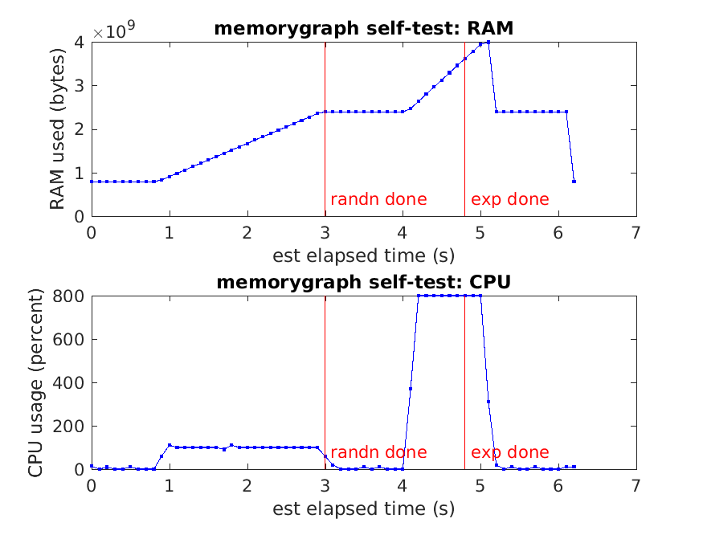

# memorygraph
MATLAB/octave unix tool to record true MATLAB/octave memory and CPU usage vs time

Alex Barnett 1/30/18-2/1/18. With improvements by Joakim Anden, Jeremy Magland.

One point of this tool is to be able to extract reliable
true peak RAM usage by
a MATLAB/ocatve code, without the need to continuously human-read (h)top.

### Installation

Place the code `memorygraph.m` somewhere in your MATLAB/octave path.

### Usage

From MATLAB/octave,
to start a graph (starts recording to a temp file in current directory):

`memorygraph('start');`

This samples every 1 sec. If you want more often use, eg

`opts.dt = 0.1; memorygraph('start',opts);`

This, or smaller dt, may cause top to slow down the CPU.

To read off graph recorded so far (this may be done multiple times):

`[bytes est_times cpu_times cpu_usages] = memorygraph('get');`

This gives outputs:

  `bytes` : total RAM used by MATLAB/octave, in bytes  
  `est_times` : estimated clock time in secs since graph started  
  `cpu_times` : MATLAB/octave CPU time used (counting all threads) reported by top  
  `cpu_usages` : current percentage CPU usage by MATLAB/octave at each time  

To clean up (kills the spawned processes and removes the temp file):

`memorygraph('done');`

Without args: does a self-test, produces the graph shown above.

### Notes:

- Linux/unix only. Tested in MATLAB and octave.  
- Hard-coded temp-file location for now.  
- Max run time is baked in at 1e4 secs (about 3 hrs).  
- The `top` display config must be standard (no changes to `/etc/toprc` nor `~/.toprc`).  

### Issues:

- How do we get actual timestamps without estimating? (spawn 2nd process which appends to same temp file at time intervals?)  

### Changes:

- Joakim and Jeremy helped fix the correct PID for the MATLAB/octave instance
and the correct PID to kill.